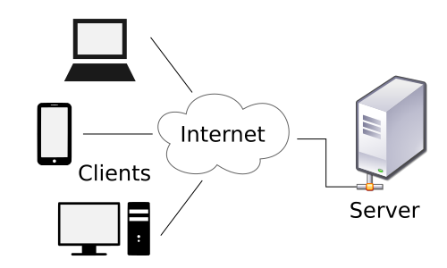

:::note Metadata
|Lecture equivalent| Duration |
|-|-|
|3| 2h 15min |

At the end of this task, students

* can explain and present DevOps
* can send `GET` and `POST` requests with cURL and/or Postman and analyze the results
* have invited themselves to the private ExMan packer repository (see [repositories](docs/help/repositories)) using an issue (thus have learned to create issues)
:::

## Explore DevOps

:::tip Task
Head over to our [DevOps](docs/theory/devops) section and follow the Atlassian resource. Read the [complete overview](https://www.atlassian.com/devops/what-is-devops).
:::

## Client-Server


> Client-server denotes a relationship between cooperating programs in an application, composed of clients initiating requests for services and servers providing that function or service. - *[omnisci.com](https://www.omnisci.com/technical-glossary/client-server)*

### Basic architectural thoughts



We discussed in the lecture basic principles of client-server architectures. Here are some more resources you can consider:

- [omnisci.com/technical-glossary/client-server](https://www.omnisci.com/technical-glossary/client-server)
- [wiki/Client–server_model](https://en.wikipedia.org/wiki/Client–server_model)

### Communication
There is two main, rough ways you (as _client_) can communicate with a a server:

- ⚡️ Synchronous: You expect an answer immediately and you will wait until you have it.
- ⏱ Asynchronous: You trigger a procedure (or not even) and passively wait for the result (doing other stuff in between)

**Spoiler:** Cloud architecture does and should rely mostly on asynchronous (async) communication. It is very expensive and also annoying to actively wait for every change. Let the server tell us when hes done!


### Application Programming Interfaces (APIs)
APIs and their design are one of the most challenging disciplines out there. It is extremely difficult to design a never-aging, never-changing API. To be honest I think it might be _impossible_ in any scenario where you want to develop or stay agile. Anyhow there are various figures and shapes of APIs and their protocols:

- [REST](https://en.wikipedia.org/wiki/Representational_state_transfer)
- [SOAP](https://en.wikipedia.org/wiki/SOAP)
- [gRPC](https://grpc.io/)
- [WebSocket](https://developer.mozilla.org/en-US/docs/Web/API/WebSockets_API)
- ...

All of them have their dis- and advantages and must be chosen wisely from a future engineer.

### Tools

For each API, its protocol and what so ever there are different tools available, the two most common we will inspect now.

:::tip Task
Read [cURL](/docs/tools/curl) and [Postman](docs/tools/postman) descriptions and install them to your machine. Experiment with them both until you feel comfortable and can say 🗣"I understand how this works!"
:::

With both tools installed let us now come to leverage our knowledge.

## Packer Déjà vu

You remember the `ExManRest.jar` from the first semester (lecture ALG and OOP)? You should as this is an [foundational expectation](/docs/expectations) of this lecture. The packer from the first semester has been deployed to [https://exman.azurewebsites.net/exman](https://exman.azurewebsites.net/exman).

ℹ️ It needs some time cold-starting up, ~2 minutes.

Now, as coincidence wants, this Packer has a REST API!

### Learning the basics
Clicking around in UIs is easy, you do not need to study or think for it. That is why I can not stress enough you need to understand the internals of a tool to a degree where you can say: _"I understood how that works"_. Sometimes _"I think I understood how it works"_ is also enough.

### Results
The cURLs you compose shall be your results - set them aside as they are your solution. It does not matter if you created them via Postman or cURL itself, just make sure your result are in the cURL-_format_. Also set aside the results, they prove very handy later this course.

:::warning Git
It is strictly advised to check in the results into a git repository!
:::

### API contract
Every API has a contract, here is the packers:
```
ExpeditionManager REST-Schnittstelle mit JSON. Version 1.0:

GET  /exman                                ->  gibt diese Beschreibung zurueck
GET  /exman/expeditions                    ->  holt alle Expeditionsnamen
GET  /exman/expedition/:name               ->  holt eine Expedition mit Name (Bsp: /exman/expedition/Mars)
POST /exman/expedition                     ->  speichert eine Expedition (der Name ist in der Expedition)
GET  /exman/algorithms                     ->  holt alle Algorithmennamen
POST /exman/pack?limit=20&algorithm=Simple ->  packt Expedition mit Limite und Algorithmus. Gibt selektierte Items zurueck.

Beispiel JSON-Format einer Expedition:
{
    "name":"Mars",
    "items":[
        {"name":"Roboter","weight":184,"profit":12400},
        {"name":"Messstation","weight":144,"profit":8900}
     ]
}

(c) M. B.
```


### Authentication

The packer is public 🔓, everyone who knows the URL and has internet access can use our endpoints. We might invest in a later lesson some efforts into protecting our expeditions 🔐.

### Get the description

The first REST Endpoint is `/exman`. 

:::tip Task
Get the description from it!
:::

ℹ️ If you stumble a bit, note that this must be a GET request (as the docs say).

### List all expeditions

:::tip Task
Query the second endpoint, list all expeditions names. 
:::

Three expeditions should always be there. Which ones is it?

### Get expedition `Mars`

:::tip Task
Query the `Mars` expedition and note which equipment it has saved in it.
:::

### Post your own expedition

:::tip Task
Create your own expedition, post a fantasy expedition of yours to the Packer!
:::

ℹ️ The packer is the same for everyone, so if someone created expedition `North Cape` already, you will modify this expedition instead of creating your own. If you want really your own, maybe prefix it like `my-own-name-North Cape`.

ℹ️ As this is not very practical, we will check later in our course how we can separate tenants or reference expeditions by a more unique identifier.

### Fetch your own expedition again

Did the Packer save your expedition? 

:::tip Task
Check it with the `GET` commands.
:::

### Get all packaging algorithms

:::tip Task
Use the `/algorithms` endpoint to get all available packing methods.
:::

### Pack `Mars`

:::tip Task
Time to pack 📦 Box in the Mars expeditions using each algorithm once!
:::

### Pack your own expedition

:::tip Task
Apply the packaging to your own expedition, did you choose the profits and weights well? Could you go to your expedition goal with what you just packed?
:::

---

## Invite to Packer

:::tip Task
Create an issue in [this repository](https://github.com/nds-swe/swdt/issues/new/choose) stating your GitHub handle (username) and that you would like access.
:::
If you do not know how to create an issue, read [this](https://docs.github.com/en/github/managing-your-work-on-github/creating-an-issue).